## Hi, I'm Daniel 👋

**Frontend Engineer** · 🇮🇪 Irish, based in London 💂

I build fast, accessible commerce experiences used by millions, and I ship them with AI agents as part of my everyday workflow.

  

### 🛠️ What I'm doing now

- 🛒 Engineering the **basket at Argos**: a server-rendered React app serving Argos, Habitat and Tu shoppers from one multi-brand codebase
- ⚡ Rebuilding customer journeys on **Next.js and React 19**, and contributing to our shared component library built on Sainsbury's **Fable** design system
- 🤖 Working **AI-native**: Claude Code and Copilot agents, MCP servers and custom agent skills are part of how I plan, build, test and review

### 🧭 How I work in the AI era

> Agents write more of the code than ever. I focus on owning the architecture, setting the guardrails and keeping the bar high.

### 💻 Tech I reach for

  
  
  
  
  
  
  &nbsp;&nbsp;
  
  
  

### 🌍 Other passions

🥾 Hiking · ✈️ Travelling · 💪 Fitness · 📈 Trading
